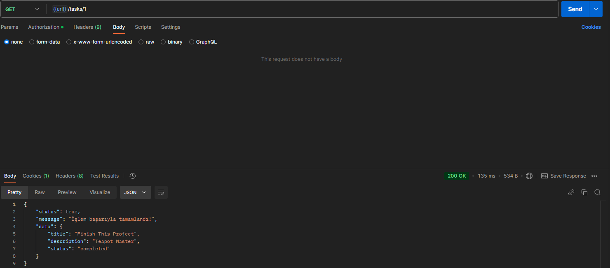
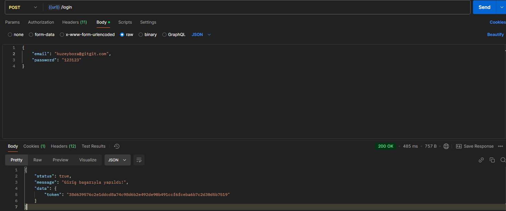
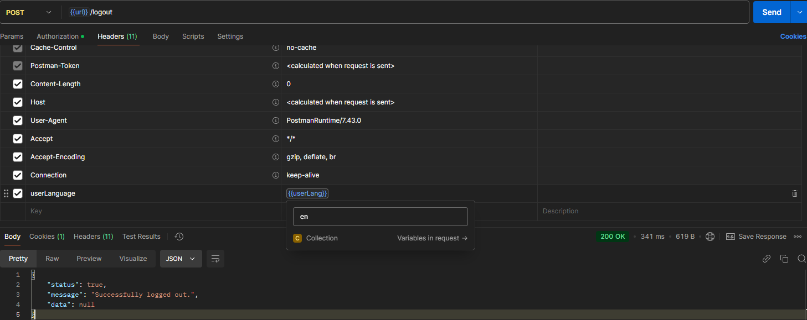
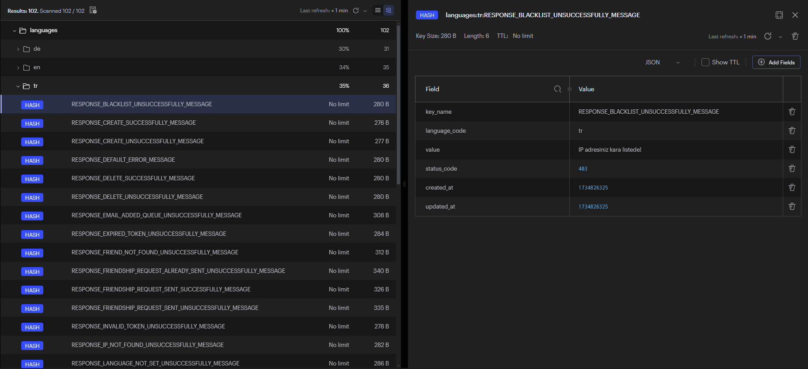

# CodeIgniter 4 Restful Todo Api Project

CodeIgniter 4 Restful Todo API projesi, kullanıcıların görevlerini yönetebileceği ve arkadaşlarına görev atayabileceği bir API sunar. Kullanıcılar birbirlerine arkadaşlık istekleri gönderebilir, kabul edebilir veya reddedebilirler.

Projede Shield kullanılarak güvenli kimlik doğrulama ve yetkilendirme sağlanmış, kullanıcı verileri güvence altına alınmıştır. Multilingual destekle Türkçe, İngilizce ve Almanca dillerinde hizmet verilmektedir.

Redis, uygulamanın performansını artırmak için kullanılırken, MongoDB log yönetimi için tercih edilmiştir. Bu sayede hızlı veri erişimi ve etkin log depolama sağlanmaktadır.

## Temel Özellikler

- **Arkadaşlık Sistemi**: Kullanıcılar birbirlerine arkadaşlık isteği gönderebilir, gelen isteklere yanıt verebilir (kabul/ret) ve arkadaş listelerini yönetebilirler.

- **Görev Yönetimi**: Kullanıcılar kendi görevlerini oluşturabilir, güncelleyebilir, silebilir ve arkadaşlarına görev atayabilirler.

- **Multilingual Destek**: Uygulama Türkçe, İngilizce ve Almanca dillerini destekler.

- **Güvenli Kimlik Doğrulama**: Shield kütüphanesi kullanılarak güvenli ve esnek kullanıcı doğrulama ve yetkilendirme işlemleri gerçekleştirilmiştir.

- **Yüksek Performans**: Redis ile yüksek hızda veri işlemleri ve oturum yönetimi sağlanırken, MongoDB log yönetimi için kullanılmaktadır.

- **RESTful API**: API, modern ve temiz bir tasarımla tüm istemciler için kullanılabilir. CRUD operasyonları ile görevler yönetilebilir.

## Api Kullanımı
- - -
##### Kullanıcı İşlemleri
| HTTP Metodu | Endpoint Adı |    URL    |    Body Parametreleri     | Token |
|:-----------:|:------------:|:---------:|:-------------------------:|:-----:|
|    POST     |  Giriş Yap   |  /login   |      Email, Password      |   ❌   |
|    POST     |   Kayıt Ol   | /register | Username, Email, password |   ❌   |
|    POST     |  Çıkış Yap   |  /logout  |                           |   ✅   |

##### Görev İşlemleri

| HTTP Metodu |       Endpoint Adı       |        URL        |       Body Parametreleri       |  Token  |
|:-----------:|:------------------------:|:-----------------:|:------------------------------:|:-------:|
|     GET     |    Görevleri Listele     |      /tasks       |                                |    ✅    |
|     GET     | Idye göre Görevi listele |    /tasks/$id     |                                |    ✅    |
|    POST     |      Görev Oluştur       |      /tasks       |   title, description, status   |    ✅    |
|    POST     |   Görevi Arkadaşa Ata    | /tasks/assignTask |  task_id(int), friend_id(int)  |    ✅    |
|     PUT     | Idye Göre Görev Güncelle |    /tasks/$id     |   title, description, status   |    ✅    |
|     DEL     |   Idye Gore Görev Sil    |    /tasks/$id     |                                |    ✅    |

##### Arkadaşlık İşlemleri

| HTTP Metodu |       Endpoint Adı       |              URL               |  Token  |
|:-----------:|:------------------------:|:------------------------------:|:-------:|
|    POST     | Arkadaşlık İsteği Gönder |  /friendship/send-request/$id  |    ✅    |
|     GET     |      Gelen İstekler      | /friendship/incoming-requests  |    ✅    |
|    POST     |     İsteği Kabul Et      | /friendship/accept-request/$id |    ✅    |
|    POST     |      İsteği Reddet       | /friendship/reject-request/$id |    ✅    |
|     GET     |   Arkadaşları Listele    |      /friendship/friends       |    ✅    |

## Örnek İstekler

## Projeyi Çoklu dilli Kullanma

Projeyi farklı bir dilde kullanmak istiyorsanız (tr, en, de), istek gönderirken Headers kısmında şu şekilde veri göndermelisiniz.
> userLanguage = en | de | tr
> 

## Redisin Projedeki Yeri

Proje, Türkçe (TR), İngilizce (EN) ve Almanca (DE) olmak üzere çok dilli destek sağlar.
Redis, bu dillerin çevrim içi çeviri anahtarlarını veya metinlerini önbellekte tutar. Bu sayede, her dil çevirisi için veritabanına sorgu yapılması engellenir.

> 

